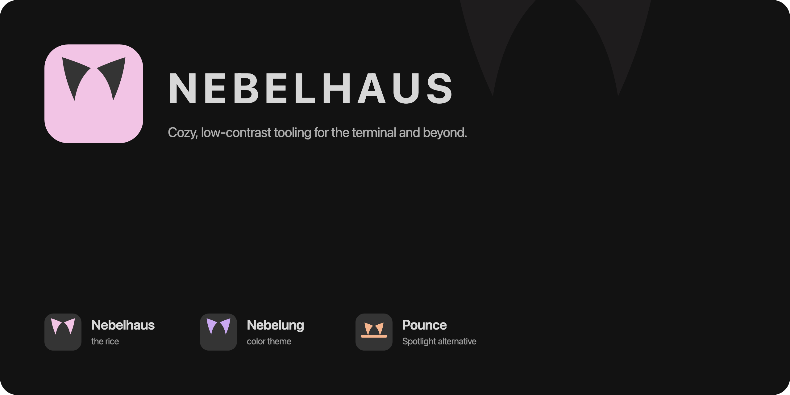
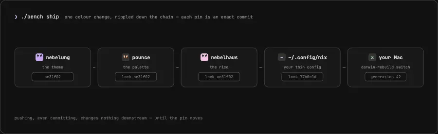

<div align="center">

# 🌫 the nebelhaus workshop

**every repo in the family, in one place — and the tool that moves changes between them**



</div>

---

This directory is the working checkout of the whole
[nebelhaus](https://github.com/nebelhaus) org. Each subdirectory is its own
repo; this folder itself is a small repo holding this README, a `CLAUDE.md`, the
`bench` script, and the `web/` docs site (nebelhaus.com), plus `assets/` and
`test/`. If you can only remember one thing:
**work anywhere, then `./bench status` tells you what's out of sync and
`./bench ship` makes it right.**

## the family

| repo | what it owns | you edit it when… |
|------|--------------|-------------------|
| 🌫 [**nebelung**](https://github.com/nebelhaus/nebelung) | the colors — a silver-mist Catppuccin variant + per-tool theme templates | you want a different shade of fog |
| 🐾 [**pounce**](https://github.com/nebelhaus/pounce) | the command palette — a native Swift launcher + its generic command scripts | the palette app or a built-in command changes |
| 🐦 [**trill**](https://github.com/nebelhaus/trill) | the Messages client — a native SwiftUI iMessage/SMS/RCS reader over `chat.db` | the messages app UI or its providers change |
| 🏠 [**nebelhaus**](https://github.com/nebelhaus/nebelhaus) | the rice — nix-darwin modules for macOS defaults, tiling, bar, shell, security | anything about *how the system behaves* |
| 🐙 [**org-profile**](https://github.com/nebelhaus/.github) | the org's front page on GitHub | the pitch changes |
| 🍺 [**homebrew-tap**](https://github.com/nebelhaus/homebrew-tap) | the Homebrew tap (`brew tap nebelhaus/tap`) | almost never — CI bumps it on every `bench release` |
| 🔒 `~/.config/nix` | **your machine** (private, lives outside this dir) | your apps, identity, secrets |

New to the parts? [AeroSpace](https://github.com/nikitabobko/AeroSpace) is a
tiling window manager for macOS (windows arrange themselves, keyboard moves
them). [SketchyBar](https://github.com/FelixKratz/SketchyBar) replaces the menu
bar. [Nix](https://nixos.org) makes the whole setup reproducible: the entire
machine is described in text files, and one command makes reality match them.

## how the repos feed each other

Each link is a *flake input* — a pinned reference to an exact commit of the
upstream repo, recorded in the downstream repo's `flake.lock`:



### flakes in sixty seconds (the part that bites)

A flake input is **not** "whatever is on GitHub right now" — it's an exact
commit hash, frozen in `flake.lock`. That's what makes a rebuild reproducible.
The flip side: **committing, even pushing, changes nothing downstream** until
the downstream lock is updated to the new commit. So a color change travels
like this:

1. edit `nebelung`, commit, push
2. in `nebelhaus`: `nix flake update nebelung` (moves the pin), commit, push
3. in `~/.config/nix`: `nix flake update nebelhaus`, rebuild

That's three repos of ceremony for one hex value — which is why `bench` exists.
`./bench ship` performs exactly that ripple, in order, and `./bench status`
shows every pin that's fallen behind.

## the workflows

**Daily driving** — you only touch your machine (a new app, an alias):

```sh
# edit ~/.config/nix/hosts/<host>/default.nix, then:
./bench rebuild        # build first, switch second — a failed build never touches the system
```

**Hacking on the rice / theme / pounce** — the important one. You never need
to push to "see" a change; `try` builds your real machine config against the
**local checkouts**, uncommitted edits and all:

```sh
# edit anything in nebelung/, pounce/, nebelhaus/…
./bench try            # does it build?  (nothing pushed, nothing activated)
./bench try switch     # run it on this Mac  (still nothing pushed)
# happy? commit in the repo(s) you touched, then:
./bench ship           # pushes upstream→downstream, updating each lock along the way
```

**Parallel Claude agents** — `Super c` (⌘C) in any repo tab spawns a Claude
session in its **own git worktree** (own checkout, own `worktree-*` branch,
branched from local HEAD), so agents never yank the branch out from under each
other — or you. The worktrees live *outside* the repos, in
`~/.cache/claude-worktrees/<repo>/<name>`: Claude Code's `WorktreeCreate` /
`WorktreeRemove` hooks (in `~/.claude/settings.json`) delegate to
`wt create` / `wt remove` — the standalone `wt` tool that ships in the rice
(`nebelhaus/modules/den`), not a `bench` command — which is what keeps
`git status` and `bench try`'s overrides clean. `Ctrl Alt Shift c` spawns the
one agent allowed to edit the checkout you're looking at.

```sh
# Super-c (⌘C) panes hack away on their own branches; meanwhile:
./bench status               # …also lists agent worktrees + unmerged worktree-* branches
# an agent (or you, cd'd into its worktree) can prove its branch builds:
./bench try                  # from inside a worktree: that repo's override points AT the worktree
# an agent lands work by opening a PR — never by pushing to or merging into main:
git -C nebelung push -u origin worktree-<name> && gh pr create -R nebelhaus/nebelung
# happy with the PR? merge it on GitHub (or `gh pr merge`) — a PR is conflict-
# detected and atomic, so parallel agents can't clobber each other's commits
# closing the claude pane removes the worktree; the branch + PR survive until merged
```

Activating a Mac is **serial** — one `darwin-rebuild switch` = one machine
state — so with a stack of PRs waiting you can only feel-test one at a time.
The trap is to merge them all to `main` first, then rebuild and tick them off:
now unverified code is on `main` before you've felt it. `bench try-batch`
inverts that — it merges every **open PR** onto a throwaway integration tree
per repo, overrides the flake at those trees, and builds (or activates) the
whole queue in ONE rebuild, `main` untouched:

```sh
./bench try-batch            # build every open PR together; prints a tick-off checklist
./bench try-batch switch     # …and activate the combined tree on this Mac
# verify each PR (its body carries the Verify steps), then merge only the winners.
```

Each PR's body doubles as the checklist entry, so give PRs a **What / Why /
Verify / Watch-out** body: the session that wrote the code is gone by the time
it's tested, so a bug found later is recoverable from `gh pr view` alone.

**Catching up** — on another machine, or after shipping from elsewhere:

```sh
./bench pull && ./bench rebuild
```

**Releasing** — three repos are releasable (pounce, trill, nebelhaus), each with a real audience:

Versions are **date-based** (CalVer): a release is stamped with the day it's
cut — `2026.07.18`, or `2026.07.18-1`, `-2`, … for a second release the same
day. No number is ever typed by hand; `bench release` computes the date, writes
it into the repo's version source, commits, and tags it.

```sh
./bench ship                # everything pushed & locks current first
./bench release pounce      # date-stamps pkgs/pounce/default.nix + tags v<date> —
                            # CI publishes the release + bumps the homebrew formula
./bench release trill       # date-stamps VERSION + tags v<date> — CI bumps the
                            # homebrew cask
./bench release nebelhaus   # date-stamps VERSION + tags v<date> — this is what
                            # nebelhaus.com/init.sh serves to new installs
```

The rice one matters more than it looks: the install one-liner serves the
**latest rice release**, so until you cut one, new users bootstrap from the
previous tag no matter what's on `main`. Ship user-visible rice changes, then
release. (The date-stamp moves the repo's HEAD, so `bench ship` once more after
to ripple that lock downstream.)

## the bench commands

| command | what it does |
|---------|--------------|
| `./bench status` | git state of every repo, every lock edge (who's pinning an old rev of whom), and every release edge (is the tag users install from behind main?) |
| `./bench try [switch]` | build (and optionally activate) your machine against the local checkouts |
| `./bench ship` | push everything in dependency order, rippling `flake.lock` updates downstream |
| `./bench rebuild` | plain pinned rebuild of `~/.config/nix` |
| `./bench pull` | fast-forward every repo |
| `./bench clone` | fetch any family repo missing from this directory |
| `./bench release <repo>` | date-stamp the version (`v<YYYY.MM.DD>`, `-N` on a same-day repeat) + tag it — CI publishes the release + bumps the brew tap |
| `./bench docs-since [--mark]` | every commit since the docs were last reconciled, per repo — the input to the daily `/docs-sync` sweep (`--mark` moves the watermark) |

Tip: the rice ships a `bench` shell alias, so these work from anywhere.

The Claude worktree hooks are **not** a `bench` command — they call the
standalone `wt` tool (`wt create` / `wt remove`, JSON on stdin) that ships in
the rice. Run `wt` bare to list every parked/live agent worktree across all
repos, `wt <name>` to resume one.

## the whole life of a change

```
hack ──► test ──► try ──► PR ──► merge ──► ship ──► release
```

1. **hack** — edit in place, or let `Super c` (⌘C) agents draft on `worktree-*`
   branches in parallel; the main checkouts never move.
2. **test** — `./bench try` from wherever you are: it builds your real machine
   against the local checkouts (from inside an agent worktree, against *that*
   branch). `./bench try switch` activates it — main checkouts only; it refuses
   from a worktree.
3. **PR + merge** — an agent lands its branch by opening a PR against `main`,
   never by pushing to or `git merge`-ing into `main` (parallel agents doing
   that clobbered each other — a PR is conflict-detected and atomic). You review
   and merge the PRs you like; the branch, and a nagging `bench status` line,
   survive until you do.
4. **ship** — commit, then `./bench ship` pushes upstream→downstream, rippling
   every `flake.lock`.
5. **release** — `./bench release <repo>` date-stamps the version and tags it,
   and CI does the rest (pounce: GitHub release + Homebrew formula; nebelhaus:
   the tag `init.sh` serves to new installs).

## setting up this workshop on a fresh machine

```sh
git clone https://github.com/nebelhaus/workshop.git ~/code/nebelhaus
cd ~/code/nebelhaus && ./bench clone
```

(Your private `~/.config/nix` is restored separately — see its own README.)

## where a change goes

Every repo's `CLAUDE.md` opens with the same routing table, so a session
started anywhere knows whether it's in the right place. The short version:
**colors → nebelung · the palette app → pounce · system behavior → nebelhaus ·
personal anything → `~/.config/nix`**. When in doubt, start here and read
[`CLAUDE.md`](./CLAUDE.md).

## roadmap

- **nebelhaus tui options program** — A custom install script that people can `curl` and pipe into bash. It will spawn a (ts/bun/node) TUI allowing people to input information and choose preferences for their rice (like favorite IDE, accent color, etc.). These answers will template `nebelhaus.*` options into the generated host file.
- **Screenshots** — `assets/hero.png` in the rice is still a placeholder
  (pounce's `assets/demo.webp` hero is shot); for a rice, the screenshot *is* the pitch.
